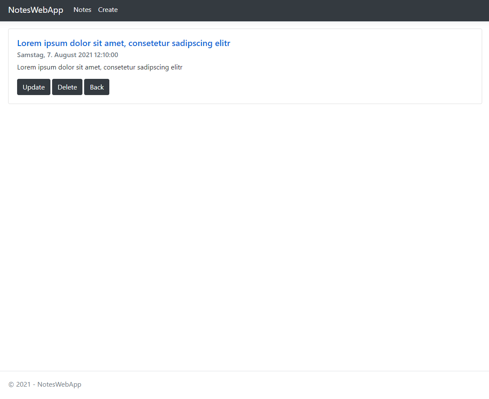
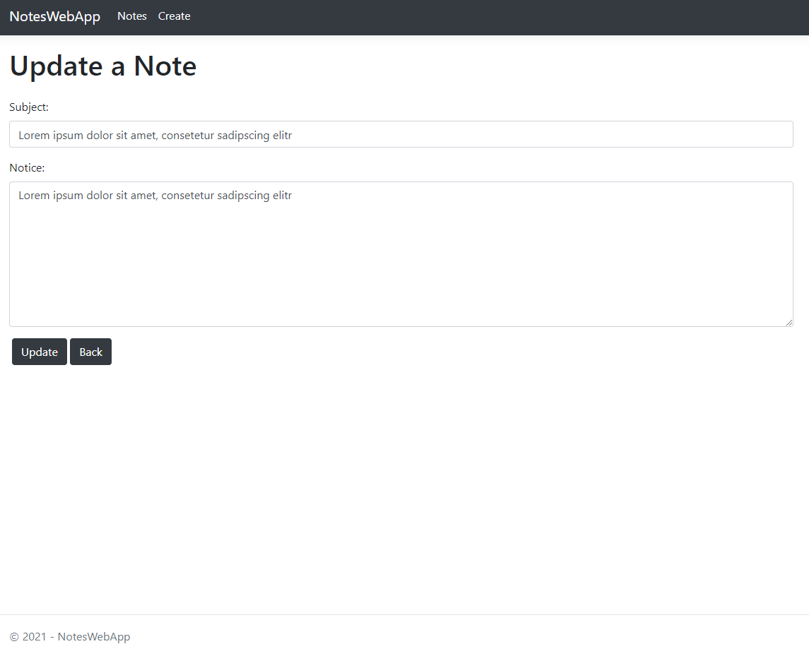
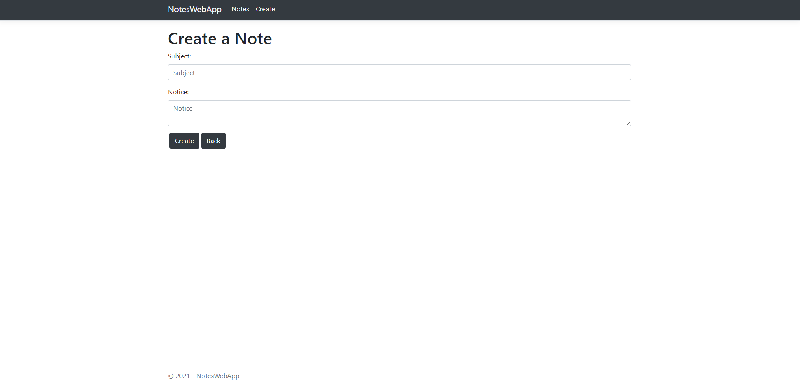

# NotesWebApp

## General info
> Here I coded my first notes web application for learning ASP.NET Core MVC.
> It contains all CRUD operations to create, read, update  and delete a note.

## Screenshots

## Technologies
* ASP.NET Core - version 3.1
* design pattern: MVC 
* Entity Framework Core - version 5.0.8
* MS SQL Server database
* Bootstrap 4 - responsive design
* HTML5
* CSS3 

## Setup
Just download the project und let it run in Visual Studio Community. 
The notes web app will be started and a sql db will be created thus you can start writing your first note.

## Features
* Display all notes
* Display one note by Id
* Create a note
* Update a note by Id
* Delete a note by Id

To-do list:
* unobtrusive jquery
* error page handling
* finish model validation and 
* validation attributes
* Error Messages

## Status
Project is: _almost finished_