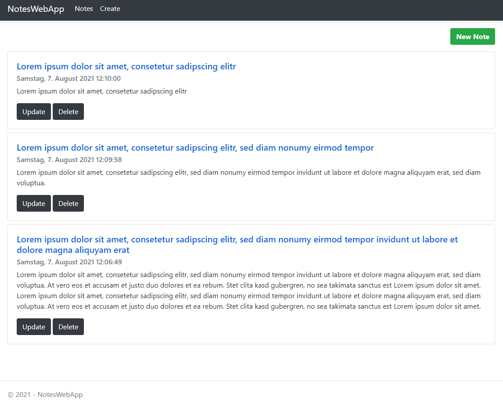
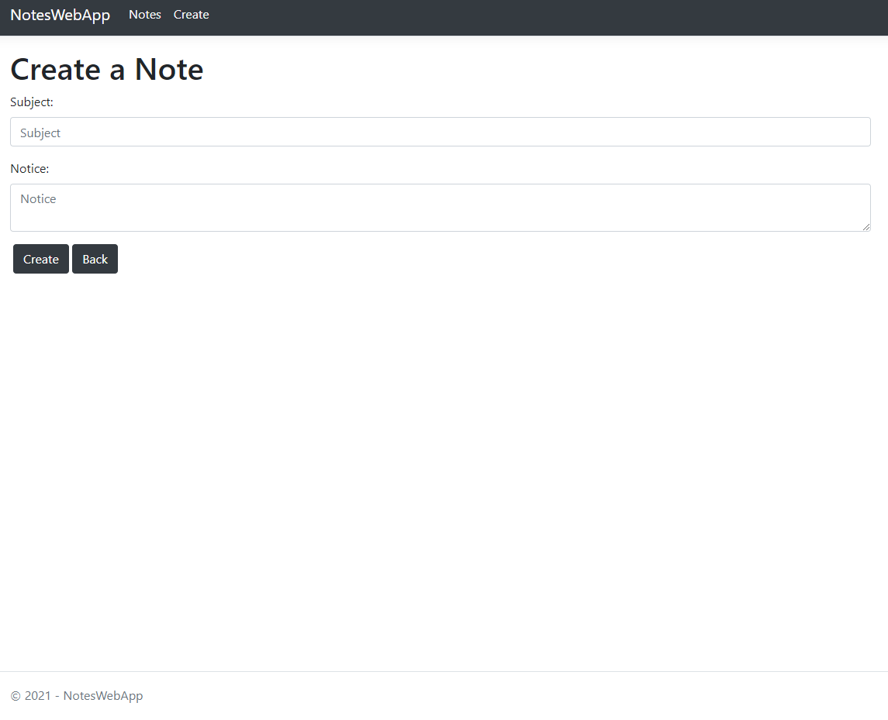

# NotesWebApp

## General info
Here I coded my first notes web application for learning ASP.NET Core MVC.  
It contains all CRUD operations to create, read, update and delete a note.

## Screenshots
<figure>
	<figcaption><strong>Display all Notes</strong></figcaption>
	
</figure>

<figure>
	<figcaption><strong>Display one Note</strong></figcaption>
	
</figure>

<figure>
	<figcaption><strong>Update a Note</strong></figcaption>
	
</figure>

<figure>
	<figcaption><strong>Create a Note</strong></figcaption>
	
</figure>

## Technologies
* ASP.NET Core - version 3.1
* design pattern: MVC 
* Entity Framework Core - version 5.0.8
* IIS + MS SQL Server
* Bootstrap 4 - responsive design
* HTML5
* CSS3 

## Setup
Just download the project und let it run in Visual Studio Community. 
The notes web app will be started and a sql db will be created thus you can start writing your first note.

## Features
* Display all notes
* Display one note by Id
* Create a note
* Update a note by Id
* Delete a note by Id

## Status
Project is: _finished_